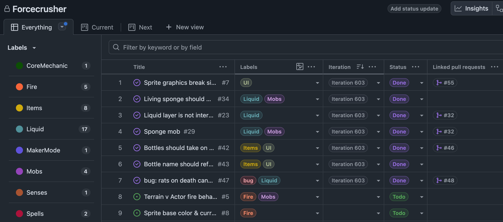
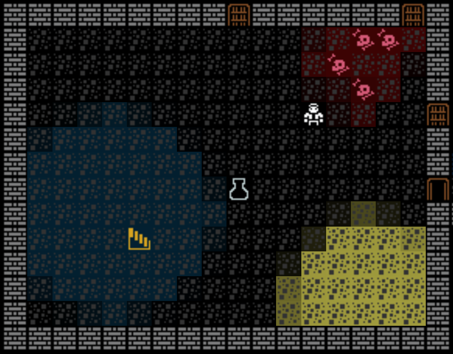
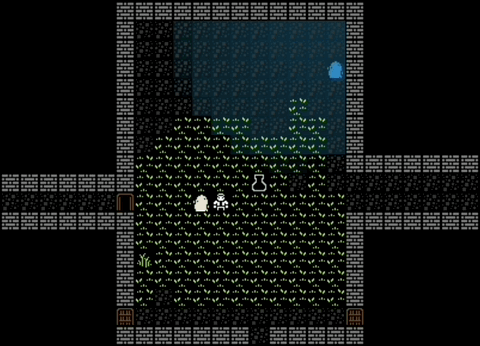
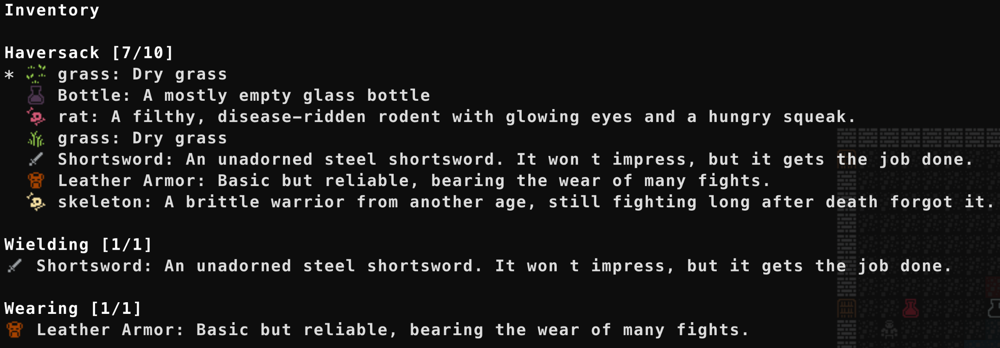

Got sick of managing this project from a loose markdown file and **set up a GitHub project**. Feels much more… official.

Wrapped up interactive fluid layers for now. There’s still some work to do, but most of the worst bugs are fixed. The biggest issue was a case where killing multiple rats in the same vicinity caused spilled blood to multiply exponentially and flood the entire dungeon. It turns out having multiple bi-directional fluid containers at the same position is bad. Fluid containers are now directional, and only “floor” fluid containers are bi-directional. A dead rat can bleed, but it won’t try to absorb anything anymore.

Living sponges are now a thing. They randomly select a fluid to absorb on spawn and will only absorb that fluid. Their color reflects their contents. It would be good to spawn them with a bit of fluid inside so it’s more obvious what they absorb. It might also be a good idea to limit possible fluids to those available in the dungeon. Right now it’s possible to spawn a water sponge on a level with no water, which just results in a useless mob.

The bottle UI has been improved. Bottles now render with the color of their contents. They can contain multiple fluid types, so the color is a weighted mix of those fluids. The sprite changes between empty, half-full, and full based on volume. The actual fluid mix (as seen when inspecting a puddle) isn’t yet displayed in the inventory, but it should be. Bottles are also corked, so they can be placed without spilling everything. They don’t yet break when thrown, though, so for now bottles are mostly useful for removing fluid hazards like lava or oil.

The addition of graphics a while ago broke the legend and inventory UIs — that’s now fixed. I had to refactor `canvas.ts` to add support for mixed-width rendering. This is the kind of work where AI has really shined for me. I wrote the `canvas.ts` rendering logic years ago and have ported it to ever game since. I dropped the file into ChatGPT with an explanation of what I needed to change, and it acted as a thought partner, walking through how and why to refactor it.

Previously, I was setting tile width on the canvas itself and using array indexing to find and update tiles, which only works if tiles have a consistent width and height. ChatGPT suggested implementing a cursor-based positioning system. Instead of storing width on the canvas, it’s stored on the token. Tokens can be glyphs (graphics) or text. A couple of helper functions understand the token types and handle rendering and cursor progression.

I’m not a fan of vibe coding, but I _have_ found AI as a thought partner to be extremely valuable. I started partnering with it over the past year and have learned a ton. Many refactors and complex systems would have taken much longer without what amounts to an extremely detailed, on-demand manual for roguelike development. AI is a much larger discussion, but the more I use it, the more I understand its value of it as a **tool** — and the less I worry about the impending robot apocalypse or the false promises of tech entrepreneurs just trying to sell me something.
